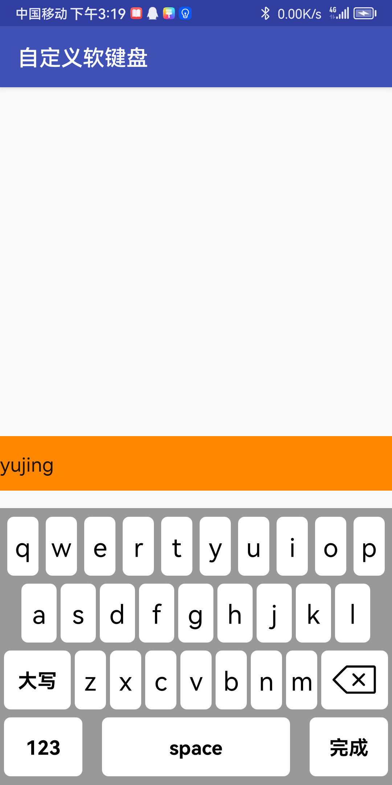
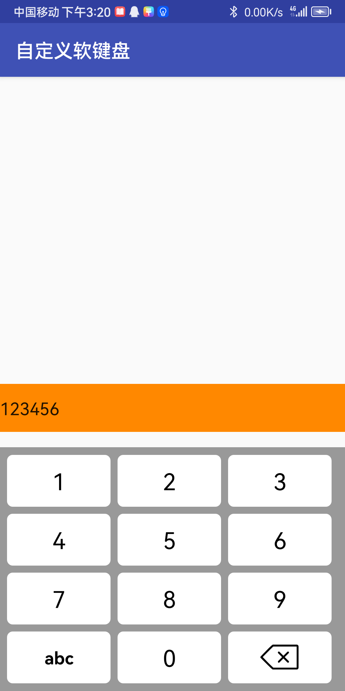

# 自定义软键盘
自定义软键盘，安卓13.0，API33，androidx。
支持数字键盘，英文小写键盘，英文大写键盘。随机数字键盘，支持webView回调。

感谢网上大佬给出源码，我只是做了androidx兼容。

## 开发环境准备
**推荐使用jetBrains Toolbox 中的android studio，并更新到最新正式版**  

【必须】打开AS的安装目录，在bin目录下找到这两个文件（studio.exe.vmoptions，studio64.exe.vmoptions）  
在其中最后一行添加	-Dfile.encoding=UTF-8   

|                           字母键盘                            |                           数字键盘                            |
| :-------------------------------------------------------: | :-------------------------------------------------------: |
|  |  |
